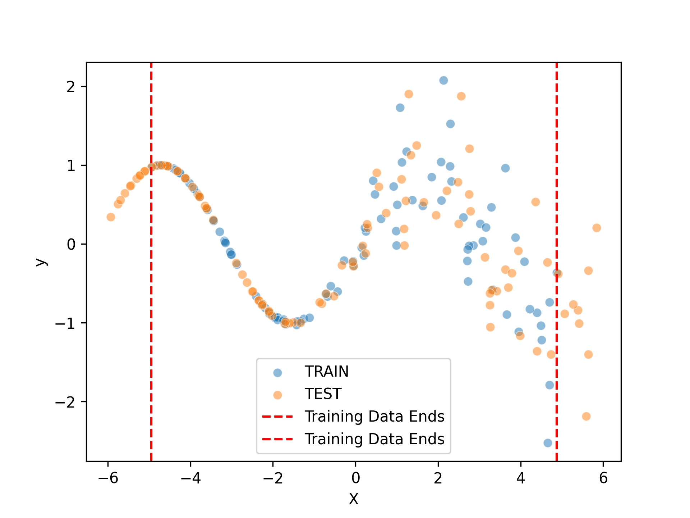
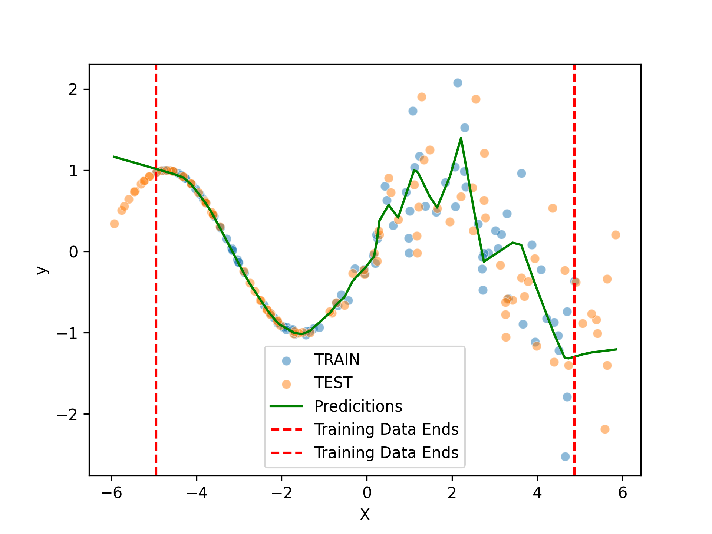
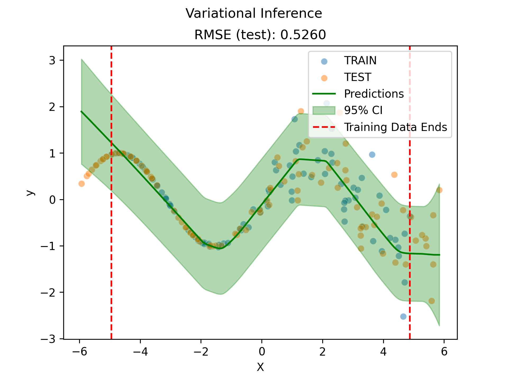
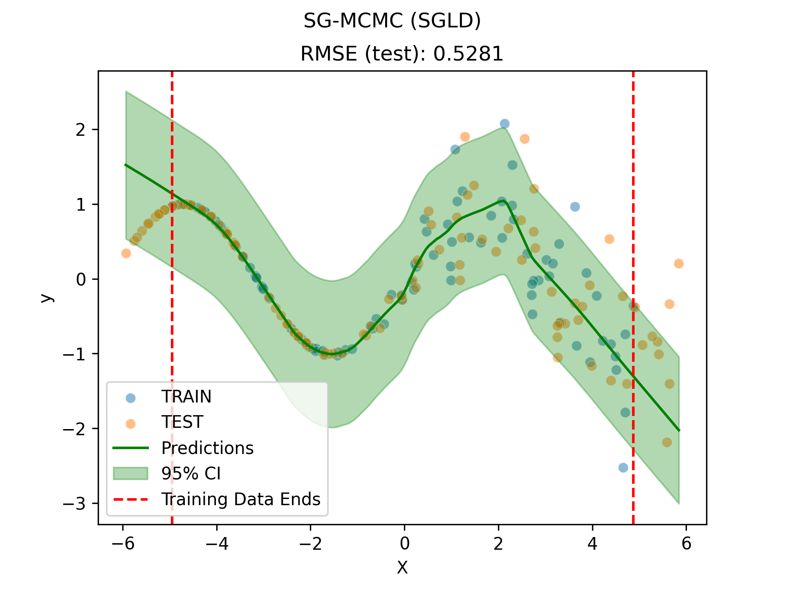
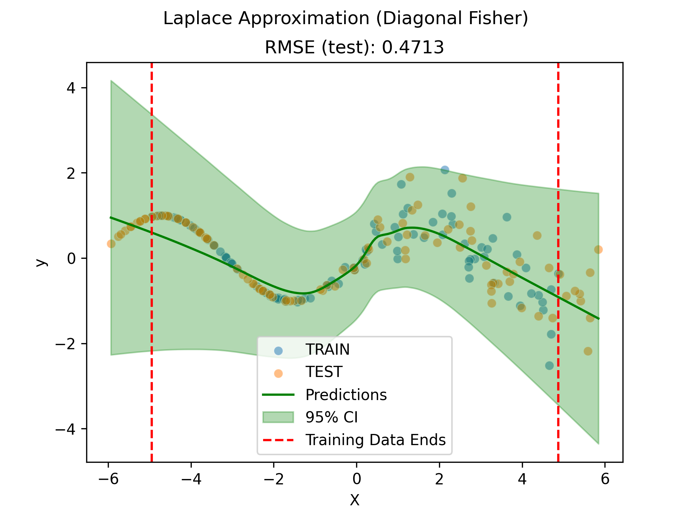
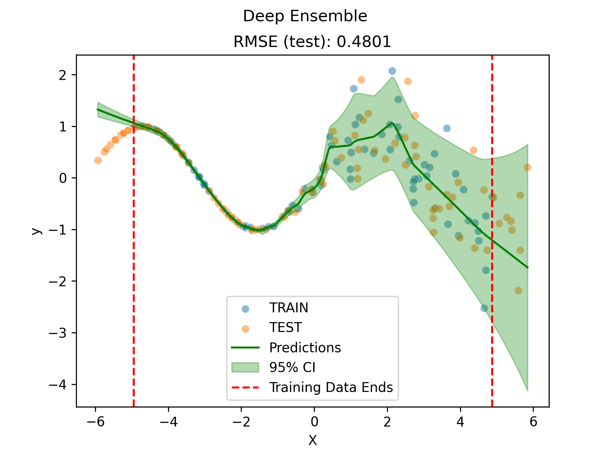

# Lab 3: Uncertainty Quantification in Neural Networks

## Dataset

The dataset consists of 100 training and 100 test samples of a 1D regression task. The test set includes points outside the training distribution, making it a good benchmark for evaluating uncertainty estimates.

## Methods

Five models were trained and evaluated:

1. **Vanilla NN** — A deterministic feedforward network (1→64→64→1) trained with MSE loss. Provides point estimates only, with no uncertainty quantification.
2. **Variational Inference (VI)** — A Bayesian neural network with a diagonal Gaussian variational posterior, trained using ELBO maximization with a N(0, 5²) prior.
3. **SG-MCMC (SGLD)** — Stochastic Gradient Langevin Dynamics, which collects approximate posterior samples during optimization.
4. **Laplace Approximation** — A two-phase approach: first trains a MAP estimate, then fits a diagonal Gaussian posterior using the Fisher information matrix.
5. **Deep Ensemble** — An ensemble of M=5 networks, each outputting a mean and variance, aggregated using the law of total variance.

## Results

| Method                  | Test RMSE |
|-------------------------|-----------|
| Vanilla NN (baseline)   | 0.5640    |
| Variational Inference   | 0.5260    |
| SG-MCMC (SGLD)          | 0.5281    |
| Laplace Approximation   | **0.4713**|
| Deep Ensemble           | 0.4801    |

## Prediction Plots

### Vanilla NN

### Variational Inference

### SG-MCMC (SGLD)

### Laplace Approximation

### Deep Ensemble

## Interpretation

All four uncertainty-aware methods outperform the vanilla NN baseline in test RMSE, demonstrating that incorporating uncertainty into the modeling process can improve predictive accuracy. The Laplace approximation achieves the best RMSE (0.4713), followed closely by the deep ensemble (0.4801). This is likely because the Laplace method benefits from a strong MAP initialization before fitting the posterior, while the deep ensemble captures model diversity through independent training runs. Variational inference and SG-MCMC perform similarly to each other (0.5260 and 0.5281), suggesting that both approximate the posterior to a comparable degree on this task. Examining the prediction plots, all Bayesian and ensemble methods appropriately show wider confidence intervals in regions outside the training data boundaries, correctly reflecting increased epistemic uncertainty where data is scarce. The deep ensemble produces notably tighter and more calibrated confidence bands within the training range, while VI and SG-MCMC exhibit slightly broader uncertainty throughout. Overall, these results highlight that even simple uncertainty quantification techniques can meaningfully improve both predictions and reliability estimates on out-of-distribution data.
